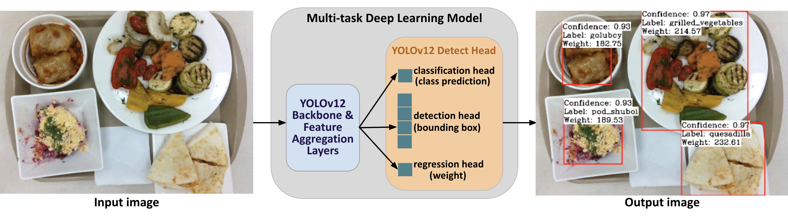
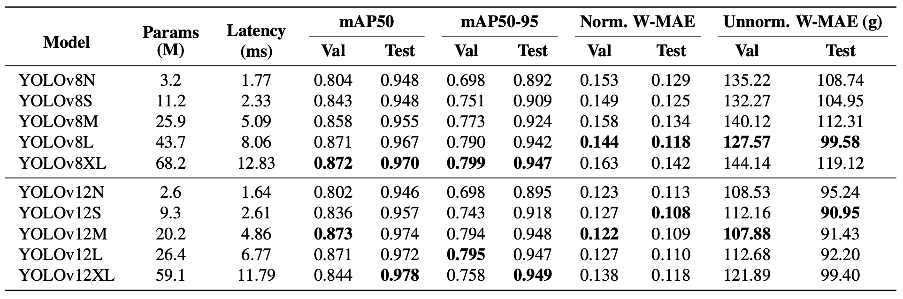

<div align="center">

<h1>YOLOv12-FoodWeight</h1>
<h3>Multi-Task Real-Time Food Detection and Weight Estimation</h3>

<p align="center">
  <br>
  <em>Proposed Multi-task food detection and weight estimation model based YOLOv12 architecture.</em>
</p>

</div>

---

## Overview

This project builds upon the YOLOv12 architecture to perform **multi-task learning**: 

- **Object Detection**: Detect food items.
- **Weight Prediction**: Predict the weight (in grams) of each detected food item.

We introduce an additional regression head to YOLOv12 to predict weights, enabling simultaneous localization and portion estimation from a single image.


## Main Features

- **Multi-task** Food object detection and weight (in grams) prediction.
- **Single unified model**: Jointly trained for classification, localization, and regression tasks.
- **Evaluation metrics**: Includes MAE (Mean Absolute Error) for weight estimation.


## Dataset Format

Our model is trained and evaluated on a specialized food dataset with annotated bounding boxes and weight labels in grams, available on Hugging Face:

➡️ [Download Food Portion Benchmark Dataset on Hugging Face](https://huggingface.co/datasets/issai/Food_Portion_Benchmark)

Each image has an associated `.txt` label file containing six columns:

- `class_id` (integer): ID of the food class.
- `x_center` (float): Normalized x center of bounding box (0 to 1).
- `y_center` (float): Normalized y center of bounding box (0 to 1).
- `width` (float): Normalized width of bounding box (0 to 1).
- `height` (float): Normalized height of bounding box (0 to 1).
- `weight` (float): Ground truth weight of the food item in grams.

This extended label format enables simultaneous object detection and weight regression.


## Results

<p align="center">
  <br>
  <em>Training results comparing the different versions of the YOLOv8 and YOLOv12 models</em>
</p>


## Pretrained Weights

You can download the best-performing pretrained YOLOv12-M model weights here:

- [YOLOv12-FoodWeight Medium (best checkpoint)](https://huggingface.co/your-model-link)


## Installation

```bash
conda create -n yolov12_foodweight python=3.11
conda activate yolov12_foodweight

# Install dependencies
pip install -r requirements.txt
pip install -e .

# (Optional) For FlashAttention support
wget https://github.com/Dao-AILab/flash-attention/releases/download/v2.7.3/flash_attn-2.7.3+cu11torch2.2cxx11abiFALSE-cp311-cp311-linux_x86_64.whl
pip install flash_attn-2.7.3+cu11torch2.2cxx11abiFALSE-cp311-cp311-linux_x86_64.whl
```

## Training

Training is handled through the `train.py` script. This script loads the modified YOLOv12 model configuration, prepares the dataset, and launches the training process.

- You can train the model from scratch or fine-tune a pretrained YOLOv12 checkpoint.
- The model is trained to perform both object detection and weight regression tasks simultaneously.
- The training outputs include model checkpoints, loss curves, and metric evaluations over epochs.


## Testing and Prediction

We provide few scripts to generate predictions:
- **`calculate_weight_MAE.py`**: Runs inference, calculates regression MAE metric for weight prediction, and optionally save annotated images showing detection and predicted weights.
- **`predict_txt.py`**: Runs inference and saves the predictions in a `.txt` format.
- **`predict_csv.py`**: Runs inference and saves the predictions in a `.csv` format.
- **`YOLOv8_version_code`**: Includes code for the YOLOv8 version of this project, as described in the paper.

Each prediction contains:
- `image_name`, `class_id`, `xmin`, `ymin`, `xmax`, `ymax`, `weight`, `confidence`

Choose the format depending on your post-processing or evaluation needs.


## Acknowledgment

This project is based on [ultralytics/ultralytics](https://github.com/ultralytics/ultralytics) and [YOLOv12](https://github.com/sunsmarterjie/yolov12). We extend the original work with an additional regression head for food weight prediction.

## Citation

Please cite our work if you use the Multi-task model. (Citation will be added after publication.)

```BibTeX
@article{Sanatbyek_2025,
    title={A multitask deep learning model for food scene recognition and portion estimation—the Food Portion Benchmark (FPB) dataset}, 
    volume={13}, 
    DOI={10.1109/access.2025.3603287}, 
    journal={IEEE Access}, 
    author={Sanatbyek, Aibota and Rakhimzhanova, Tomiris and Nurmanova, Bibinur and Omarova, Zhuldyz and Rakhmankulova, Aidana and Orazbayev, Rustem and Varol, Huseyin Atakan and Chan, Mei Yen}, 
    year={2025}, 
    pages={152033–152045}
}
```
